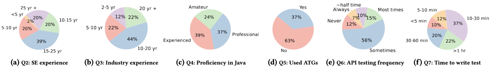

# SAINT: Service-level Integration Test Generation with Program Analysis and LLM-based Agents

[](https://conf.researchr.org/details/icse-2026/icse-2026-research-track/143/SAINT-Service-level-Integration-Test-Generation-with-Program-Analysis-and-LLM-based-)
[](https://creativecommons.org/licenses/by-nc-nd/4.0/)

## 📖 Overview

**SAINT** (Service-level Integration Test Generation with Program Analysis and LLM-based Agents) is a novel white-box testing approach for service-level testing of enterprise Java applications. Enterprise applications are typically tested at multiple levels, with service-level testing playing an important role in validating application functionality. 

Existing service-level testing tools, especially for RESTful APIs, often employ fuzzing and/or depend on OpenAPI specifications which are not readily available in real-world enterprise codebases. Moreover, they fail to generate functional tests that exercise meaningful scenarios. 

SAINT addresses these limitations by combining static analysis, large language models (LLMs), and LLM-based agents to automatically generate both endpoint-focused and scenario-based tests that are functional, effective, and developer-aligned.

## 📄 Publication

This work has been accepted at **ICSE 2026** (48th International Conference on Software Engineering).

**Paper**: [SAINT: Service-level Integration Test Generation with Program Analysis and LLM-based Techniques](https://conf.researchr.org/details/icse-2026/icse-2026-research-track/143/SAINT-Service-level-Integration-Test-Generation-with-Program-Analysis-and-LLM-based-)

## 🎯 Key Features

### Core Capabilities
- **White-Box Testing**: Leverages static program analysis to understand application internals
- **No OpenAPI Required**: Works directly with source code without requiring API specifications
- **Dual Testing Modes**:
  - **Endpoint-Focused Tests**: Maximize code and database interaction coverage for individual endpoints
  - **Scenario-Based Tests**: Generate realistic user workflows by extracting and refining application use cases
- **LLM-Based Agents**: Employs planning, action, and reflection phases for intelligent test generation
- **High Coverage**: Achieves high branch and line coverage with minimal variance
- **Cost-Effective**: Optimized LLM usage with support for multiple models (Mistral, Llama, Granite, DeepSeek, OpenAI)

### Technical Innovations
1. **Endpoint Model**: Captures syntactic and semantic information about service endpoints
2. **Operation Dependency Graph (ODG)**: Models inter-endpoint ordering constraints for scenario generation
3. **Inter-Parameter Dependencies (IPD)**: Identifies relationships between parameters across endpoints
4. **Value Constraints**: Extracts valid parameter value ranges from code analysis
5. **Agentic Workflow**: Iterative refinement through planning, execution, and reflection

## 🏗️ Architecture

SAINT integrates multiple components in a sophisticated pipeline:

### 1. Static Program Analyzer
- Extracts API specifications from source code
- Builds control flow and data flow graphs
- Identifies endpoint signatures, parameters, and return types
- Analyzes database interactions and business logic

### 2. Model Construction
- **Endpoint Model**: Comprehensive representation of each API endpoint
- **Operation Dependency Graph**: Captures ordering constraints between operations
- **Inter-Parameter Dependencies**: Maps parameter relationships across endpoints

### 3. LLM-Based Test Generator
- **Coverage Agent**: Generates tests to maximize code coverage
- **Fixing Agent**: Repairs failing tests through root cause analysis
- **Scenario Agent**: Synthesizes realistic user scenarios
- Uses multiple specialized prompts for different generation tasks

### 4. Test Executor
- Runs generated tests against the application
- Collects coverage metrics (branch, line, database interaction)
- Provides feedback for iterative refinement

### 5. Feedback Loop
- Analyzes coverage gaps and test failures
- Guides agents to generate additional tests
- Iteratively refines tests until coverage goals are met

## 📊 Evaluation Results

SAINT has been evaluated on 8 real-world Java applications, including a proprietary enterprise application, demonstrating consistent performance across different domains and LLM models.

### Individual Endpoint Testing (RQ1 & RQ3)

| Application         | Std_Dev(%) (Branch, Line) | Cost ($) (Mistral, o1) | LLM Calls | HTTP Requests | Time (min) |
| ------------------- | ------------------------- | ---------------------- | --------- | ------------- | ---------- |
| **PetClinic**       | (5.2%, 1.3%)              | 0.02, 4.8              | 437       | 211           | 13.4       |
| **DayTrader**       | (0.3%, 0.4%)              | 0.04, 3.7              | 180       | 179           | 32.4       |
| **JPetStore**       | (1.6%, 0.2%)              | 0.05, 5.1              | 218       | 269           | 12.2       |
| **Restcountries**   | (1.6%, 0.1%)              | 0.04, 4.3              | 229       | 422           | 21.7       |
| **Feature-service** | (0.7%, 0.5%)              | 0.04, 11.4             | 389       | 185           | 14.7       |
| **Genome-Nexus**    | (0.1%, 0.8%)              | 0.06, 7.7              | 356       | 423           | 40.4       |
| **LanguageTool**    | (0.1%, 0.1%)              | 0.04, 4.1              | 27        | 13            | 1.5        |

### Scenario-Based Endpoint Testing (RQ2)

| Application         | Std_Dev(%) (Branch, Line) | Cost ($) (Mistral, o1) | LLM Calls | HTTP Requests | Time (min) |
| ------------------- | ------------------------- | ---------------------- | --------- | ------------- | ---------- |
| **PetClinic**       | (7.6%, 1.4%)              | 0.02, 2.3              | 128       | 15            | 3.7        |
| **DayTrader**       | (2.4%, 5.1%)              | 0.04, 4.6              | 213       | 33            | 10.1       |
| **JPetStore**       | (0.0%, 2.6%)              | 0.05, 6.4              | 187       | 24            | 7.2        |
| **Restcountries**   | (3.8%, 3.4%)              | 0.02, 3.2              | 148       | 19            | 5.9        |
| **Feature-service** | (1.8%, 2.3%)              | 0.04, 4.2              | 136       | 29            | 5.2        |
| **Genome-Nexus**    | (2.7%, 3.4%)              | 0.05, 6.0              | 216       | 25            | 17.0       |

### Key Observations

- **Low Variance**: Standard deviations are consistently low (< 8%), indicating stable and reproducible results
- **Cost Efficiency**: Using Mistral (open-source) costs $0.02-$0.06 per application, while OpenAI o1 costs $2.3-$11.4
- **Time Efficiency**: Most applications complete testing in under 20 minutes
- **Scenario-Based Advantage**: Scenario-based testing typically requires fewer HTTP requests and less time while maintaining coverage
- **Model Flexibility**: Evaluated with 5 different LLM models (Mistral Devstral, Llama-8, Granite-3.1-8, DeepSeek-R1, OpenAI o1)

### Ablation Study (RQ5)

SAINT's effectiveness is validated through ablation studies on four key components:

| Component                    | Applications Tested | Impact on Coverage |
| ---------------------------- | ------------------- | ------------------ |
| **Coverage Agent**           | 4 applications      | Significant        |
| **Inter-Parameter Dependencies** | 4 applications  | Moderate           |
| **Operation Dependency Graph** | 4 applications    | High (scenarios)   |
| **Value Constraints**        | 4 applications      | Moderate           |

Results demonstrate that each component contributes meaningfully to overall test effectiveness.

## 🔬 Research Questions

Our evaluation addresses five key research questions:

- **RQ1**: How effective is SAINT in generating tests for individual endpoints?
- **RQ2**: How effective is SAINT in generating scenario-based tests?
- **RQ3**: How does SAINT compare with different LLM models?
- **RQ4**: What is the developer perception of SAINT-generated tests?
- **RQ5**: What is the contribution of each component in SAINT?

## 📁 Repository Structure

```
saint/
├── README.md                          # This file
├── doc/                               # Documentation and figures
│   ├── readme.md                      # Additional documentation
│   └── background.png                # Developer survey background
├── RQ1+3/                            # Individual endpoint testing results
│   ├── DayTrader/                    # Results per application
│   ├── Genome-nexus/
│   ├── JPetStore/
│   ├── Languagetool/
│   ├── PetClinic/
│   ├── RestCountries/
│   └── SAINT_PROMPT/                 # All prompt templates
│       ├── code-context-agent.jinja2
│       ├── coverage-agent-*.jinja2   # Coverage generation prompts
│       ├── duplicate-fixing-request.jinja2
│       ├── entire-scenario-test-generation.jinja2
│       ├── fixing-agent-*.jinja2     # Test fixing prompts
│       ├── login-pattern.jinja2
│       ├── parameter-values.jinja2
│       ├── scenario-*.jinja2         # Scenario generation prompts
│       └── servlet_parameter_type.jinja2
├── RQ5/                              # Ablation study results
│   ├── cov_agent/                    # Coverage agent ablation
│   ├── IPD/                          # Inter-parameter dependencies ablation
│   ├── Partial_order/                # ODG ablation
│   └── Value constraints/            # Value constraints ablation
└── ASTER_Integration.pdf             # Technical documentation
```

## 🎨 Prompt Engineering

SAINT employs a sophisticated prompt engineering strategy with specialized templates for different tasks:

### Prompt Categories

1. **Code Context Analysis**
   - `code-context-agent.jinja2`: Analyze code context for test generation

2. **Coverage Generation Prompts**
   - `coverage-agent-generate-intra-endpoint-requests.jinja2`: Generate requests for coverage
   - `coverage-agent-ipd.jinja2`: Handle inter-parameter dependencies
   - `coverage-agent-parameter-type.jinja2`: Determine parameter types
   - `coverage-agent-parameter-values.jinja2`: Generate parameter values
   - `coverage-agent-progress.jinja2`: Track coverage progress
   - `coverage-agent-reflection.jinja2`: Reflect on coverage gaps
   - `coverage-agent-tool-choice.jinja2`: Select appropriate tools

3. **Test Fixing Prompts**
   - `fixing-agent-generate-intra-endpoint-requests.jinja2`: Fix request generation
   - `fixing-agent-ipd.jinja2`: Fix inter-parameter dependencies
   - `fixing-agent-parameter-type.jinja2`: Fix parameter types
   - `fixing-agent-parameter-values.jinja2`: Fix parameter values
   - `fixing-agent-reflection.jinja2`: Analyze test failures
   - `fixing-agent-tool-choice.jinja2`: Select fixing strategies
   - `duplicate-fixing-request.jinja2`: Handle duplicate tests

4. **Scenario Generation Prompts**
   - `entire-scenario-test-generation.jinja2`: Generate complete scenario tests
   - `scenario-assertion.jinja2`: Generate test assertions
   - `scenario-test-generation.jinja2`: Convert scenarios to tests

5. **Dependency Analysis Prompts**
   - `parameter-values.jinja2`: Generate constrained values
   - `login-pattern.jinja2`: Identify authentication patterns
   - `servlet_parameter_type.jinja2`: Determine servlet parameter types

Each prompt includes:
- Clear task description
- Input format specification
- Examples demonstrating expected output
- Output format constraints

## 👥 Developer Survey

<p align="center">
  
</p>

We conducted a comprehensive developer survey to evaluate the quality and usefulness of SAINT-generated tests. The survey included:

- **Participants**: Professional developers with varying levels of experience
- **Focus**: Scenario-based test quality, readability, and maintainability
- **Results**: Strong endorsement of SAINT-generated tests
- **Key Findings**: Developers found the tests to be realistic, well-structured, and aligned with actual use cases


## 🧪 Benchmark Applications

SAINT has been extensively evaluated on the following applications:

| Application       | Domain              | Endpoints | LOC    | Description                              |
| ----------------- | ------------------- | --------- | ------ | ---------------------------------------- |
| **PetClinic**     | Healthcare          | 15        | ~5K    | Veterinary clinic management system      |
| **DayTrader**     | Finance             | 12        | ~8K    | Stock trading benchmark application      |
| **JPetStore**     | E-commerce          | 18        | ~6K    | Pet store e-commerce platform            |
| **Restcountries** | Information         | 8         | ~3K    | REST API for country information         |
| **Feature-service** | DevOps            | 10        | ~4K    | Feature flag management service          |
| **Genome-Nexus**  | Bioinformatics      | 25        | ~15K   | Genomic annotation and analysis service  |
| **LanguageTool**  | NLP                 | 6         | ~10K   | Grammar and style checking service       |
| **Enterprise App** | Proprietary        | 30+       | ~50K   | Real-world enterprise application        |


## 📝 Citation

If you use SAINT in your research or project, please cite our ICSE 2026 paper:

```bibtex
@inproceedings{saint2026,
  title={SAINT: Service-level Integration Test Generation with Program Analysis and LLM-based Agents},
  author={[Authors]},
  booktitle={Proceedings of the 48th International Conference on Software Engineering (ICSE)},
  year={2026},
  publisher={ACM},
  address={New York, NY, USA},
  doi={[DOI]},
  url={https://conf.researchr.org/details/icse-2026/icse-2026-research-track/143/}
}
```

## 📄 License

This work is licensed under a [Creative Commons Attribution-NonCommercial-NoDerivatives 4.0 International License](https://creativecommons.org/licenses/by-nc-nd/4.0/).

[](https://creativecommons.org/licenses/by-nc-nd/4.0/)

## 🔗 Links

- [ICSE 2026 Paper](https://conf.researchr.org/details/icse-2026/icse-2026-research-track/143/SAINT-Service-level-Integration-Test-Generation-with-Program-Analysis-and-LLM-based-)

## 👥 Team

[Add team member information here]

## 🙏 Acknowledgments

We thank:
- The developers of the benchmark applications used in our evaluation
- The open-source community for their valuable tools and libraries
- Survey participants for their valuable feedback
- ICSE 2026 reviewers for their constructive comments

## 📧 Contact

For questions, suggestions, or collaboration opportunities, please:
- Open an issue on GitHub
- Contact the authors via email: [contact@saint-project.org]
- Join our community discussions

---

**Note**: This is a research prototype. For production use, please contact the authors for guidance and support.

**Disclaimer**: SAINT uses LLMs which may generate tests with varying quality. Always review and validate generated tests before deploying to production systems.
